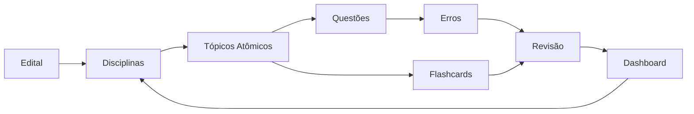

# Arquitetura do Vault

Este diagrama mostra a arquitetura operacional do vault, da fonte oficial ao
painel diário de estudo.

## Leitura

O edital define o escopo. As disciplinas organizam o conteúdo, os tópicos
atômicos transformam esse conteúdo em unidades revisáveis, e flashcards,
questões, erros e revisão fecham o ciclo de domínio.
