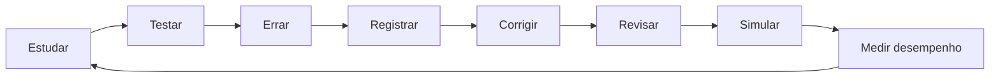

# Ciclo de Melhoria

O projeto usa erro, revisão e simulado como mecanismos de melhoria contínua.

## Leitura

O erro não encerra o ciclo. Ele vira registro, correção, revisão e novo teste
até aparecer melhora mensurável na matriz de desempenho.
