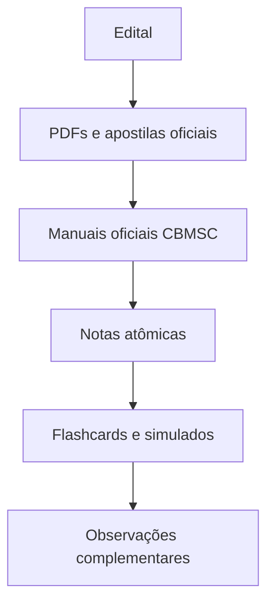

# Fidelidade ao Edital

Este diagrama mostra a hierarquia de fontes adotada pelo projeto.

## Leitura

O edital define o escopo. PDFs, apostilas e manuais oficiais definem
nomenclatura e conteúdo. Observações complementares nunca substituem fonte
oficial.
