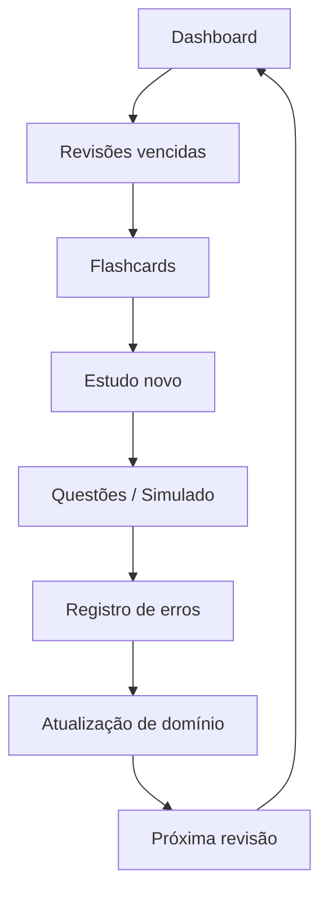

# Fluxo de Estudo Completo

Este fluxo representa a rotina operacional recomendada para usar o projeto no
dia a dia.

## Leitura

A revisão vencida vem antes do estudo novo. Questões e simulados medem o
domínio real, e os erros alimentam a próxima revisão.
