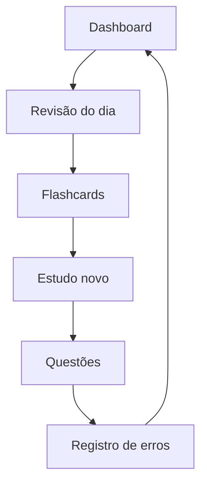

# Fluxo de estudo

```mermaid
flowchart TD
    A[Dashboard] --> B[Revisão do dia]
    B --> C[Flashcards]
    C --> D[Estudo novo]
    D --> E[Questões]
    E --> F[Registro de erros]
    F --> A
```
